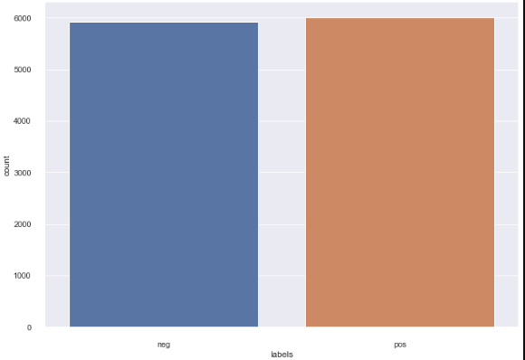

# AI
A collection of python code exploring a variety of AI methods

## Contents 

- [Neural Net](#neural-net)

- [Clustering](#clustering)

- [Sentiment Analysis](#sentiment-analysis)

## Neural Net
A neural net implemented through Python to solve the XOR problem.

Classifiers such as uni layered perceptrons can only handle linearly separable data, making them unable to solve non-linear problems like the XOR problem. Neural nets (or Multi Layered Perceptrons), however, are capable of handling such non-linear problems, making the XOR problem a suitable demonstration of their applications.

### XOR Illustration

### Classifier Decision Boundary

### Final and Hidden Output Functions

### References
  [1] https://medium.com/analytics-vidhya/coding-a-neural-network-for-xor-logic-classifier-from-scratch-b90543648e8a
  
  [2] https://towardsdatascience.com/how-neural-networks-solve-the-xor-problem-59763136bdd7
  
  [3] https://dev.to/jbahire/demystifying-the-xor-problem-1blk

## Clustering 

K-Means clustering implementation performed on a sample image of Obama.

### Data Formatting

### Results

## Sentiment Analysis

A Python program that takes in a set of sentiment labeled reviews.

A Naive-Bayes classifier and Decision-Tree classifer are trained and tested using an 80-20 split on the provided data.

### Data Sentiment Spread

### Naive Bayes : Testing Results

| Smoothing |    Accuracy   | Weighted Recall |  Weighted Precision | Weighted F1-Measure |
|-----------| ------------- | -------------   | --------------------| --------------------|
|   0.05    | 0.819135543432|  0.819135543432 |    0.819237343523   |    0.819162061498   |

### Base Decision Tree : Testing Results

|    Accuracy   | Weighted Recall |  Weighted Precision | Weighted F1-Measure |
| ------------- | -------------   | --------------------| --------------------|
| 0.685270667226|  0.685270667226 |    0.686562742126   |    0.685290619552   |

### Best Decision Tree : Testing Results

|    Accuracy   | Weighted Recall |  Weighted Precision | Weighted F1-Measure |
| ------------- | -------------   | --------------------| --------------------|
| 0.718422156945|  0.718422156945 |    0.718679219277   |    0.718483773165   |

Best-DT accuracy :  0.7184221569450273

Best-DT weighted recall :  0.7184221569450273

Best-DT weighted precision :  0.7186792192777415

Best-DT weighted f1-measure :  0.7184837731655974
