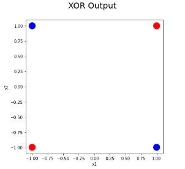
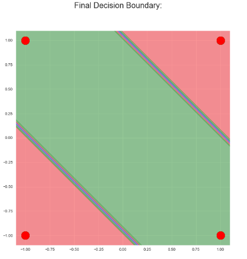
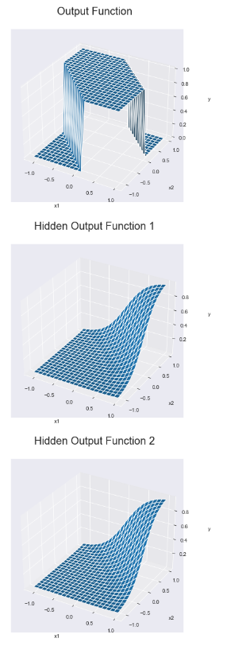
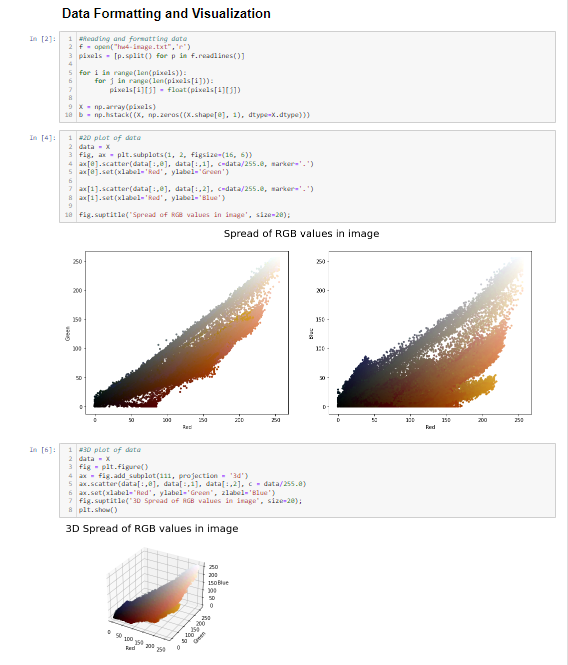
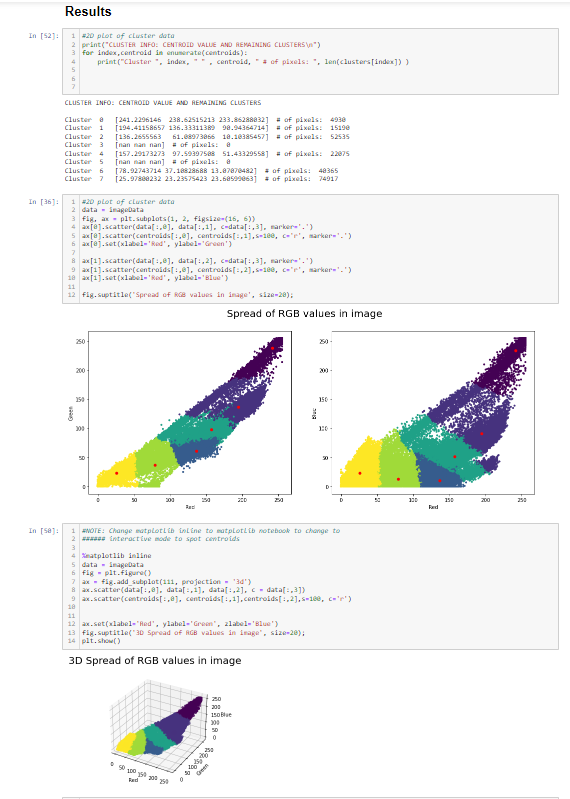

# AI
A collection of python code exploring a variety of AI methods

## Contents 

- [Neural Net](#neural-net-XOR-problem)

- [Clustering](#clustering)

## Neural Net - XOR problem
A neural net implemented through Python to solve the XOR problem.

Classifiers such as uni layered perceptrons can only handle linearly separable data, making them unable to solve non-linear problems like the XOR problem. Neural nets (or Multi Layered Perceptrons), however, are capable of handling such non-linear problems, making the XOR problem a suitable demonstration of their applications.

### XOR Illustration

### Classifier Decision Boundary

### Final and Hidden Output Functions

### References
  [1] https://medium.com/analytics-vidhya/coding-a-neural-network-for-xor-logic-classifier-from-scratch-b90543648e8a
  
  [2] https://towardsdatascience.com/how-neural-networks-solve-the-xor-problem-59763136bdd7
  
  [3] https://dev.to/jbahire/demystifying-the-xor-problem-1blk

## Clustering 

K-Means clustering implementation performed on a sample image of Obama.

### Data Formatting

### Results

